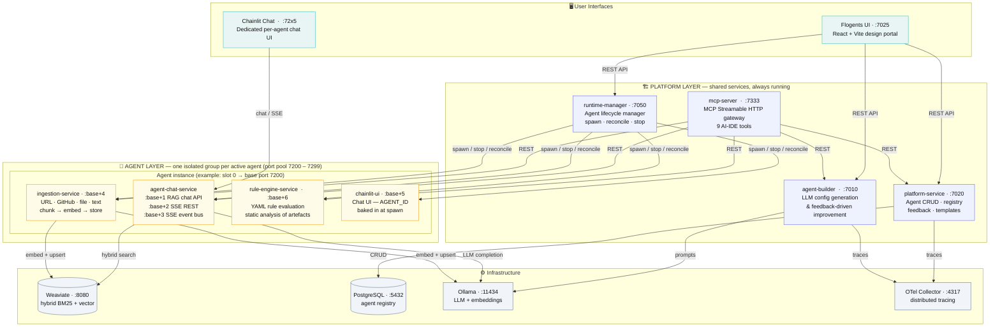
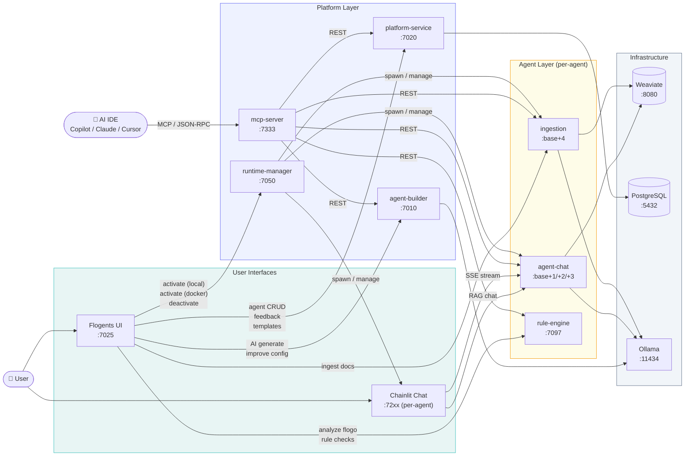

# Flogents

> **Enterprise multi-agent AI — grounded in your knowledge, governed by your rules, built on TIBCO Flogo.**

---

## Why Flogents Exists

Most AI agent frameworks give you a chat interface and an LLM call. That works for demos. It breaks down when you try to deploy AI agents for serious enterprise use:

- **Knowledge isolation** — A single shared vector store mixes Security documents with Finance reports with DevOps runbooks. Context bleed degrades answer quality across every domain.
- **No deterministic governance** — AI answers are probabilistic. There is no built-in mechanism to validate them against your schemas, configurations, or compliance rules without calling the LLM again — adding cost, latency, and more non-determinism.
- **No audit trail** — Regulated environments need structured findings with rule codes, file references, and severity levels — not a paragraph that "might" mention a violation.
- **The prototype-to-production gap** — AI services that start as notebooks require enormous infrastructure work before they are observable, restartable, and safe to put in front of real users.

Flogents was built to solve all four problems in one platform.

---

## What Flogents Is

**Flogents** is an enterprise multi-agent AI platform built on **TIBCO Flogo** — a high-performance Golang integration runtime. Every service runs as a compiled native binary: sub-millisecond request overhead, native OpenTelemetry tracing, and structured JSON logging without extra instrumentation work.

The platform follows a **two-tier architecture**:

- A **Platform Layer** of always-on shared services — agent registry, LLM config builder, MCP gateway, and the Runtime Manager that orchestrates the agent lifecycle.
- An **Agent Layer** of isolated per-agent process groups spawned on demand. Every active agent gets its own private knowledge base, RAG pipeline, ingestion service, Rule Engine, and dedicated chat UI.

---

## The Rule Engine — Deterministic Governance for Every Agent

The Rule Engine is a first-class citizen of every agent's process group — not a shared platform service. It is the answer to a question LLMs cannot reliably answer: **"Does this artefact actually conform to your standards?"**

Every agent domain has its own governance requirements: a DevOps agent needs to validate Kubernetes manifests; a TIBCO migration agent needs to flag deprecated BW5 patterns; a code review agent needs to check for OWASP vulnerabilities. The Rule Engine provides domain-specific, deterministic validation for each — configured via YAML rule sets in `config/rules/`, one set per domain.

### Why it complements the LLM rather than replacing it

| | LLM reasoning | Rule Engine |
|---|---|---|
| **Determinism** | Non-deterministic — same input, different output each run | 100% deterministic — same file, same findings, every time |
| **Speed** | 2–30 s per evaluation | Milliseconds — pure Go evaluation, zero inference cost |
| **Output format** | Freeform text | Structured JSON: rule code, file path, line number, severity, remediation |
| **Coverage** | Probabilistic — may miss violations depending on context window | Exhaustive — evaluates every node in the structured file |
| **Cost** | Per-token LLM cost for every analysis | Zero — no model inference required |

### Example finding

```json
{
  "ruleCode": "K8S-SEC-003",
  "severity": "error",
  "file": "deployment.yaml",
  "line": 42,
  "message": "Container 'api' has no resource limits — runaway process will starve other pods",
  "remediation": "Set resources.limits.cpu and resources.limits.memory"
}
```

### Built-in domain rule sets

| Agent domain | What the Rule Engine validates |
|---|---|
| **DevOps / SRE** | Kubernetes manifests — missing resource limits, privileged containers, deprecated API versions, missing liveness/readiness probes |
| **TIBCO / Integration** | BW5/BW6 archives — deprecated activities, unsupported EMS patterns, performance anti-patterns, hard migration blockers |
| **Code review** | Source files — OWASP Top 10 patterns, banned APIs, missing error handling, style violations against your team standards |
| **Flogo app analysis** | `.flogo` files — unreachable activities, missing error handlers, deprecated references, property naming violations |
| **Security / Compliance** | Infrastructure configs — open ports, weak ciphers, missing encryption, control gaps against SOC 2 / ISO 27001 |
| **Data quality** | Schemas and datasets — PII field exposure, missing required fields, type mismatches, naming convention violations |

### Where the Rule Engine is called from

| Caller | How |
|--------|-----|
| **Flogents UI** | "Analyze" button submits a selected file; findings render inline in the portal |
| **Chainlit agent chat** | Agent invokes Rule Engine analysis as a reasoning step before answering ("let me validate this manifest first") |
| **MCP tool** | `analyze_flogo` MCP tool calls the Rule Engine from Copilot / Claude / Cursor |
| **CI/CD pipeline** | Any pipeline calls `POST /api/rules/analyze` directly for shift-left governance |

This turns each agent from "an LLM that might notice something looks wrong" into **"a governed service that provably validates artefacts against your exact standards."**

---

## Why Flogents?

Most AI agent frameworks give you a chat interface and an LLM call. Flogents goes further — it treats each agent as a **managed, observable microservice** with its own knowledge base, ingestion pipeline, governance rules, and deployment lifecycle.

| Challenge | How Flogents solves it |
|-----------|--------------------------|
| **Multiple agents, multiple knowledge bases** | Each agent owns an isolated Weaviate collection. Knowledge never leaks between agents. |
| **Agents need domain knowledge, not just LLM reasoning** | Ingestion pipeline (URL, GitHub, file, text) chunks and embeds documents into the agent's collection before the agent answers anything. |
| **Answers must be grounded, not hallucinated** | Every chat response goes through a hybrid BM25 + vector RAG retrieval step before reaching the LLM. |
| **Governance and compliance validation** | The Rule Engine evaluates structured files against YAML rule sets — catching misconfigurations, deprecated patterns, and policy violations without an LLM call. |
| **AI IDE integration (Copilot, Claude, Cursor)** | The MCP server exposes 9 tools over Streamable HTTP so any MCP-compatible IDE can query agents, ingest docs, run analysis, and manage the agent lifecycle directly from the editor. |
| **Deployment flexibility** | Agents start as lightweight native processes (fast iteration) or as fully isolated Docker containers (production handoff) — switched with a single click. |
| **Observability from day one** | Every Flogo service emits OpenTelemetry traces and structured JSON logs. No instrumentation work required. |

### Who is it for?

- **Integration engineers** modernising TIBCO BW5/BW6 assets who need an advisor with deep knowledge of their specific codebase
- **Platform / DevOps teams** that need a self-service agent per product domain (security, SRE, HR, legal) without spinning up separate AI infrastructure
- **AI IDE power users** who want a local, governed RAG backend their coding assistants can query over MCP
- **Enterprises** that need auditable agent behaviour — every analysis finding is structured, every chat turn is traceable

### Representative use cases

| Domain | Example agent | How Flogents helps |
|--------|---------------|----------------------|
| DevOps / SRE | Incident responder; K8s config validator; release notes generator | Feed it your runbooks, known-error database, and Kubernetes manifests. The Rule Engine validates manifests against security and reliability rules (missing resource limits, privileged containers, etc.) and the RAG chat matches live incident symptoms to runbook remediation steps — structured output, not freeform prose. |
| Engineering | Code review assistant; API documentation generator | Ingest your team's coding standards, security rules, and OpenAPI specs. The agent reviews submitted code against those exact standards (not generic LLM opinions), returns findings by severity, and answers developer questions about endpoints with working code examples grounded in your actual API docs. |
| Finance | Financial insights analyst; procurement assistant | Ingest quarterly reports, budgets, and vendor proposals. The agent retrieves exact figures with source citations (no rounding, no hallucination) and flags deviations from procurement policy. Deterministic temperature settings ensure consistent, auditable analysis every time. |
| HR / Legal | HR policy advisor; legal contract reviewer; onboarding guide | Ground every answer strictly in your uploaded policy and contract documents. The HR agent directs employees to the relevant policy clause; the legal agent flags risky or missing clauses against your standard templates and recommends accept / negotiate / reject — without inventing obligations not in the source. |
| Security | Compliance auditor; CVE triage; security posture reviewer | Ingest your security frameworks (SOC 2, ISO 27001, NIST, internal controls). The Rule Engine evaluates configurations against control requirements; the RAG agent maps findings to specific control IDs, lists missing evidence, and outputs an audit verdict with remediation priorities and effort estimates. |
| Knowledge management | Research synthesiser; meeting intelligence; data quality inspector | Ingest research papers, meeting transcripts, or data schemas. The agent synthesises consensus and contradictions across sources, converts raw meeting notes into structured action-item tables with owner and due date, and scores datasets against your governance rules — surfacing PII exposure, missing fields, and format inconsistencies. |

---

## Architecture

Flogents is built around a clear two-tier separation. **Platform services** are shared and always running — they manage the agent registry, generate configs, and expose the MCP gateway. **Agent services** are spawned in isolated groups on demand — one complete group per active agent — and torn down when the agent is deactivated.



**Key separation**:
- Every box in the **Platform Layer** is started once at `./start-all.sh` and stays up regardless of how many agents are active.
- Every box in the **Agent Layer** is started and stopped by the Runtime Manager when an agent is activated or deactivated. Multiple agent instances run concurrently, each in its own port slot.
- The Rule Engine (`rule-engine-service`) is an **Agent Layer service**, not Platform — because governance rules are domain-specific. Each agent gets its own instance configured with its domain's YAML rule set.

---

## System Interaction Flows



---

## Service Reference

### Platform Layer — always-on

| Service | Port | Description |
|---------|------|-------------|
| `platform-service` | 7020 | Agent CRUD (`/api/v1/agents/*`), templates, feedback — PostgreSQL-backed. Merger of former `design-service` + `feedback-service`. |
| `agent-builder-service` | 7010 | LLM-generated agent config (`/api/agent-builder/generate`), feedback-driven improvement (`/improve`), validation (`/validate`). |
| `mcp-server` | 7333 | MCP Streamable HTTP gateway at `/mcp` — exposes 9 tools to AI IDEs. |
| **Flogents UI** | 7025 | React 18 + Vite design portal. |
| **runtime-manager** | 7050 | Python process manager — activates/deactivates per-agent stacks via local process spawn or Docker Compose. Reconciles every 15 s. |

### Agent Layer — per-agent, dynamic

| Service | Slot offset | Description |
|---------|-------------|-------------|
| `agent-chat-service` | `+1/+2/+3` | RAG pipeline (embed → Weaviate hybrid search → LLM). SSE streaming merged into same binary. |
| `ingestion-service` | `+4` | Document ingestion: URL, GitHub repo, raw text, file upload → chunked embeddings → Weaviate. |
| `chainlit` | `+5` | Dedicated Chainlit chat UI with `AGENT_ID` set; spawned by runtime-manager on activation. |
| `rule-engine-service` | 7097 | YAML rule evaluation and static analysis of Flogo apps / K8s configs / arbitrary structured files. |


### Infrastructure dependencies

| Dependency | Port | Purpose |
|------------|------|---------|
| Weaviate | 8080 / 50051 | Vector database (HTTP + gRPC) — hybrid BM25 + vector search |
| PostgreSQL | 5432 | Agent registry persistence |
| Ollama or any LLM | 11434 | Local LLM runtime + `nomic-embed-text` embeddings (768-dim) |

---

## Quick Start

### Prerequisites

```bash
# Infrastructure (Docker)
docker compose up weaviate postgres -d

# Ollama models
ollama pull nomic-embed-text
ollama pull llama3.2:3b          # or any model of your choice
```

### Start everything (macOS / Linux)

```bash
./start-all.sh
```

`start-all.sh` is a thin wrapper that delegates to `deployment/start-all.sh`. It:

1. Stops any existing processes on managed ports (7025, 7010, 7020, 7050, 7333, 7200–7299)
2. Clears log files and (optionally) Elasticsearch indexes
3. **Auto-builds** any Flogo binary that is missing or older than its `.flogo` source — no manual compile step needed (uses bundled `flogobuild` in `tools/`)
4. Starts **Flogents UI** (port 7025) and waits for it to be ready
5. Starts the three **Platform Layer** Flogo services (platform-service, agent-builder, mcp-server)
6. Starts the **Runtime Manager** (deployment.py, port 7050)

Agent services (chat, ingestion, chainlit) are **not** started here — the Runtime Manager starts a dedicated set when an agent is activated from the UI.

| Interface | URL |
|-----------|-----|
| Flogents Studio | http://localhost:7025 |
| Runtime Manager API | http://localhost:7050 |
| MCP Server | http://localhost:7333/mcp |


### Full stack via Docker Compose

```bash
docker compose up -d
```

---

## Agent Activation Modes

From the Flogents UI (Gallery or Editor), click **Activate** to choose how the agent's services are started:

| Mode | What happens |
|------|-------------|
| **Local Process** | Runtime Manager spawns native Flogo binaries + Chainlit directly on the host. Fast startup, no Docker required. |
| **Docker Container** | Runtime Manager calls `deployment/build-images.sh` then `docker compose up -d` for the agent's generated compose file. Fully isolated. |

Click **Deactivate** to confirm and stop all services for the agent (active chat sessions disconnected).

---

## Building from Source

Flogo binaries are auto-built on `start-all.sh` using the bundled `flogobuild` in `tools/flogobuild/`. To build manually:

```bash
# Detect the right binary for your platform
FLOGOBUILD=./tools/flogobuild/darwin_arm64/flogobuild   # macOS Apple Silicon
# FLOGOBUILD=./tools/flogobuild/linux_amd64/flogobuild  # Linux x86_64

# Platform layer
$FLOGOBUILD build-exe -f services/platform/flogo/platform-service.flogo      -c flogo-studio -o ./bin
$FLOGOBUILD build-exe -f services/platform/flogo/agent-builder-service.flogo -c flogo-studio -o ./bin
$FLOGOBUILD build-exe -f services/platform/flogo/mcp-server.flogo             -c flogo-studio -o ./bin

# Agent layer
$FLOGOBUILD build-exe -f services/agent/flogo/agent-chat-service.flogo  -c flogo-studio -o ./bin
$FLOGOBUILD build-exe -f services/agent/flogo/ingestion-service.flogo   -c flogo-studio -o ./bin
$FLOGOBUILD build-exe -f services/agent/flogo/rule-engine-service.flogo -c flogo-studio -o ./bin
```

Build context `flogo-studio` = TIBCO Flogo 2.26.3 build 2442.

Set `BUILD_BINARIES=never` to skip auto-build on startup (e.g. when binaries are pre-built).

---

## MCP Integration

The `mcp-server` exposes Flogents Studio as an MCP server named **`flogo-studio-agent-assist`**.

The `.mcp.json` at the project root auto-registers it for any compatible AI IDE running in this directory:

```json
{
  "mcpServers": {
    "flogo-studio-agent-assist": {
      "type": "sse",
      "url": "http://localhost:7333/mcp"
    }
  }
}
```

To register globally, add the same block to `~/.mcp.json` or your IDE's MCP configuration.

### Available MCP tools

| Tool | Description |
|------|-------------|
| `list_agents` | List all registered agents |
| `get_agent` | Get a specific agent config by ID |
| `create_agent` | Create a new agent |
| `update_agent` | Update an existing agent |
| `deploy_agent` | Activate / deactivate an agent |
| `rag_chat` | Ask a question against an agent's knowledge base |
| `ingest_documents` | Ingest documents into a collection |
| `submit_feedback` | Submit feedback for an agent session |
| `analyze_flogo` | Run static analysis rules on a Flogo app |

---

## Agent Templates

21 built-in agent templates in `config/agents/` give you a head start:

| Category | Templates |
|----------|-----------|
| **Integration / TIBCO** | `tibco-integration-advisor`, `businessworks-migration-advisor`, `analyzer-agent` |
| **DevOps / Engineering** | `devops-sre-assistant`, `code-review-assistant`, `release-notes-generator`, `api-documentation-assistant` |
| **Business / Finance** | `financial-insights-analyst`, `sales-intelligence-agent`, `procurement-assistant`, `product-manager-assistant` |
| **HR / Legal / Compliance** | `hr-policy-advisor`, `legal-contract-reviewer`, `security-compliance-auditor`, `employee-onboarding-guide` |
| **Knowledge / Research** | `research-synthesizer`, `meeting-intelligence-assistant`, `data-quality-inspector`, `it-incident-responder` |
| **General** | `rag-assistant`, `support-agent` |

---

## Repository Layout

```
flogo-agent-studio/
├── services/
│   ├── platform/
│   │   ├── flogo/               # Platform Flogo source files (.flogo)
│   │   │   ├── platform-service.flogo          # design + feedback merged
│   │   │   ├── agent-builder-service.flogo
│   │   │   └── mcp-server.flogo
│   │   ├── env/                 # Platform service property env files
│   │   └── ui/forge/            # Flogents React + Vite portal (port 7025)
│   ├── agent/
│   │   ├── flogo/               # Per-agent Flogo source files (.flogo)
│   │   │   ├── agent-chat-service.flogo        # RAG chat + SSE merged
│   │   │   ├── ingestion-service.flogo
│   │   │   └── rule-engine-service.flogo
│   │   ├── env/                 # Per-agent service property env files
│   │   └── ui/chainlit/         # Chainlit chat UI (app.py, port 72xx per-agent)
│   └── launch.py                # Python launcher — injects env vars via os.execve
├── deployment/
│   ├── deployment.py            # Runtime Manager (port 7050)
│   ├── start-all.sh             # Main start script (called by root start-all.sh)
│   ├── build-images.sh          # Docker image builder for agent services
│   └── Dockerfile.flogo-service # Flogo service Docker image
├── bin/                         # Compiled Flogo binaries (git-ignored)
├── tools/
│   ├── flogobuild/
│   │   ├── darwin_arm64/        # flogobuild binary — macOS Apple Silicon
│   │   └── linux_amd64/         # flogobuild binary — Linux x86_64
│   └── go-wrapper/              # go wrapper with -e flag for tidy
├── config/
│   ├── agents/                  # 21 agent template JSON files
│   └── rules/                   # YAML rule sets for rule-engine-service
├── data/
│   ├── feedback/                # JSONL feedback storage (git-ignored)
│   └── agent-runtime.json       # Runtime Manager state (git-ignored)
├── tests/
│   ├── smoke_test.py            # Health check sweep (all services)
│   ├── e2e_journey.py           # Full end-to-end journey (~32 steps)
│   ├── functional_tests.py      # Per-service API tests
│   └── e2e_functional.py        # Extended functional E2E suite
├── logs/                        # Runtime logs (git-ignored)
├── docker-compose.yml           # Full-stack Docker Compose
├── ports.yaml                   # Canonical port registry
├── start-all.sh                 # Wrapper → deployment/start-all.sh
├── start-platform.sh            # Start platform services only
├── start-mcp.sh                 # Start MCP server only
└── .mcp.json                    # MCP server registration for AI IDEs
```

---

## Testing

```bash
# Health check all services
python3 tests/smoke_test.py

# Full end-to-end journey (~32 steps across all services)
python3 tests/e2e_journey.py

# Per-service functional tests
python3 tests/functional_tests.py

# Extended functional E2E suite
python3 tests/e2e_functional.py
```

---

## Observability

All Flogo services emit **OpenTelemetry** traces (OTLP gRPC → `localhost:4317`) and structured JSON logs with injected `trace_id` / `span_id`. Set `OTEL_ENABLED=false` before running `start-all.sh` to skip if the collector is not available.

```bash
OTEL_ENABLED=false ./start-all.sh
```

---

## Tech Stack

| Layer | Technology |
|-------|------------|
| Service runtime | TIBCO Flogo |
| Vector database | Weaviate — hybrid BM25 + vector search |
| LLM | any of your choice |
| Embeddings | any of your choice|
| Agent persistence | PostgreSQL |
| Design portal | React 18 + Vite + Tailwind CSS v3 |
| Agent Chat UI | Chainlit 1.3+ |
| Deployment Management | Python asyncio (`deployment.py`) |
| Containerisation | Docker Compose (per-agent generated manifests) |
| MCP transport | Streamable HTTP / SSE (JSON-RPC 2.0) |
