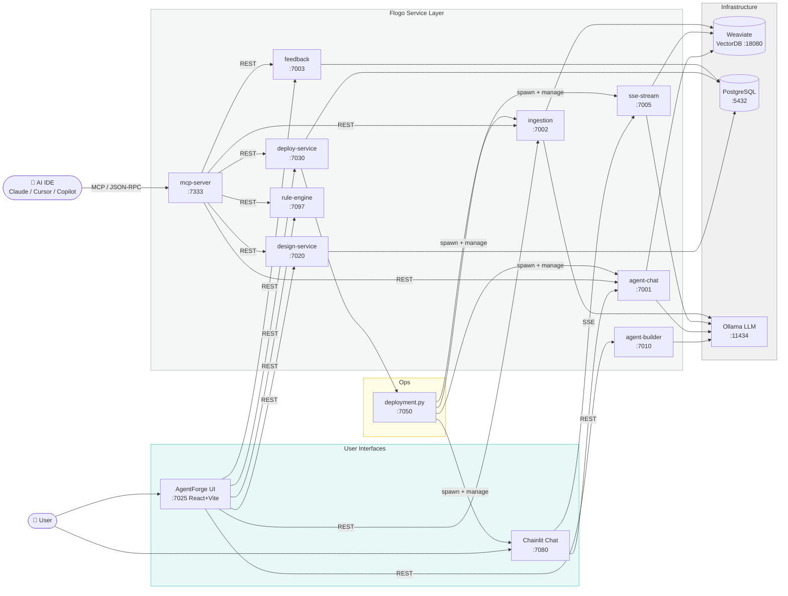
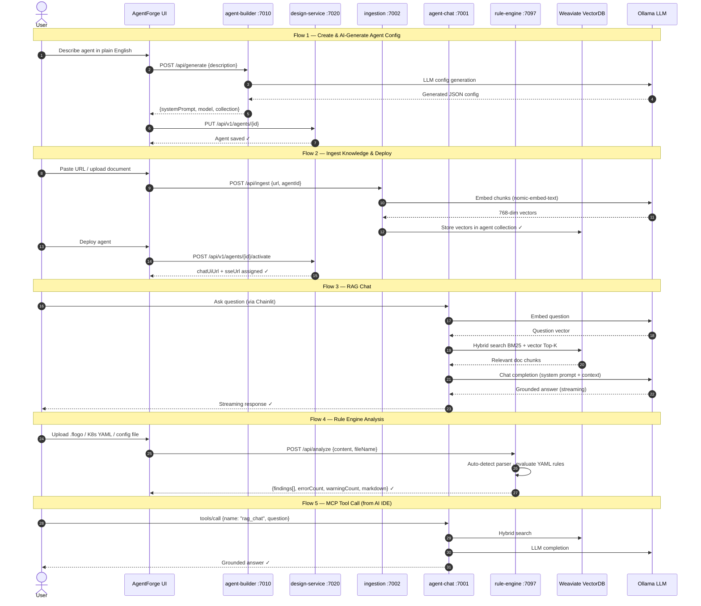

# AgentForge Studio

**AgentForge Studio** is a multi-agent AI platform built entirely on **TIBCO Flogo**. Nine  services handle RAG retrieval, streaming, rule analysis, agent lifecycle, and MCP tool exposure. The **AgentForge** React portal and **Chainlit** chat UI complete the full-stack experience.

---

## Architecture



---

## Service Interaction Flows



---

## Services

| Service | Port | Purpose |
|---|---|---|
| `design-service` | 7020 | Agent CRUD lifecycle — PostgreSQL-backed registry |
| `deploy-service` | 7030 | Activate/deactivate agents; export K8s + docker-compose YAML |
| `agent-builder-service` | 7010 | LLM-generated agent config; feedback-driven improvement |
| `agent-chat-service` | 7001 | RAG pipeline: embed → Weaviate hybrid search → LLM answer |
| `ingestion-service` | 7002 | Document ingestion into Weaviate (URL, GitHub, raw text) |
| `feedback-service` | 7003 | Per-agent rating + comment storage (JSONL) |
| `rule-engine-service` | 7097 | Static analysis of data against YAML rule sets |
| `sse-stream-service` | 7005 | SSE broadcast hub + streaming RAG+LLM pipeline |
| `mcp-server` | 7333 | MCP Streamable HTTP gateway (9 tools) |
| **AgentForge UI** | 7025 | React + Vite design portal |
| **Chainlit Chat UI** | 7080 | Chainlit chat interface |

### External dependencies

| Dependency | Port | Purpose |
|---|---|---|
| Weaviate | 8080 / 50051 | Vector database (HTTP + gRPC) |
| PostgreSQL | 5432 | Agent registry persistence |
| Ollama | 11434 | Local LLM + embedding runtime |
| OTel Collector | 4317 | Distributed tracing (optional) |

---

## Quick Start

### Prerequisites

```bash
# 1. Infrastructure (Docker)
docker compose up weaviate postgres -d

# 2. Ollama models
ollama pull nomic-embed-text
ollama pull llama3.2:3b          # or any model of choice

# 3. Flogo binaries built into bin/ (see Building section)
```

### macOS / Linux

```bash
./start-all.sh
```

Starts Forge UI (port 7025), Chainlit (port 7080), then all 9 Flogo services. Logs go to `logs/`.

| UI | URL |
|---|---|
| AgentForge Studio | http://localhost:7025 |
| Chainlit Chat | http://localhost:7080 |

### Windows

```powershell
.\start-all.ps1
```

### Docker Compose (full stack)

```bash
docker compose up -d
```

---

## Building from Source

Flogo services are built with `flogobuild`:

```bash
# Build a single service
flogobuild build-exe \
  -f services/apps/rule-engine-service.flogo \
  -c flogo-v2263-2442 \
  -o ./bin

# Build all 9 services
for svc in rule-engine-service agent-chat-service ingestion-service \
           feedback-service sse-stream-service agent-builder-service \
           design-service deploy-service mcp-server; do
  flogobuild build-exe -f services/apps/${svc}.flogo -c flogo-v2263-2442 -o ./bin
done
```

Build context `flogo-v2263-2442` = TIBCO Flogo 2.26.3 build 2442.

---

## MCP Integration

Add to `.mcp.json` in your project or home directory:

```json
{
  "mcpServers": {
    "agentforge": {
      "type": "http",
      "url": "http://localhost:7333/mcp"
    }
  }
}
```

Available MCP tools:

| Tool | Description |
|---|---|
| `list_agents` | List all registered agents |
| `get_agent` | Get a specific agent config by ID |
| `create_agent` | Create a new agent |
| `update_agent` | Update an existing agent |
| `deploy_agent` | Activate / deactivate an agent |
| `rag_chat` | Ask a question against an agent's knowledge base |
| `ingest_documents` | Ingest documents into a collection |
| `submit_feedback` | Submit feedback for an agent session |
| `analyze_flogo` | Run static analysis rules on a Flogo app |

---

## Repository Layout

```
flogo-agent-studio/
├── services/
│   ├── apps/          # Flogo source files (.flogo) — runtime source of truth
│   ├── bin/           # Symlinks → ../bin/ (used by start-all.sh)
│   ├── env/           # Per-service property env files (FLOGO_APP_PROPS_ENV=auto)
│   └── launch.py      # Python launcher — injects env vars via os.execve
├── bin/               # Compiled Flogo binaries (gitignored)
├── ui/
│   ├── forge/         # AgentForge React portal (Vite, port 7025)
│   └── chainlit/      # Chainlit chat UI (Python, port 7080)
├── config/
│   ├── agents/        # Runtime agent configs (UUID-named, gitignored)
│   ├── agents/          # Seed templates (analyzer, rag-assistant, support)
│   └── rules/         # YAML rule sets for rule-engine-service
├── data/feedback/     # JSONL feedback storage (gitignored)
├── tests/             # Test suite
│   ├── e2e_journey.py        # 32-step end-to-end scenario
│   ├── functional_tests.py   # Per-service API tests
│   └── smoke_test.py         # Health check sweep
├── logs/              # Runtime logs (gitignored)
├── docker-compose.yml
├── start-all.sh       # macOS/Linux start script
├── start-all.ps1      # Windows start script
└── ports.yaml         # Canonical port registry
```

---

## Testing

```bash
# Smoke test — health check all services
python3 tests/smoke_test.py

# Full end-to-end journey (32 steps across all 9 services)
python3 tests/e2e_journey.py

# Per-service functional tests
python3 tests/functional_tests.py
```

Latest results: **32/32 steps passing** (2026-05-19).

---

## Tech Stack

| Layer | Technology |
|---|---|
| Service runtime | TIBCO Flogo 2.26.3 (compiled Go) |
| Vector database | Weaviate (hybrid BM25 + vector search) |
| LLM runtime | Ollama (local) |
| Embeddings | nomic-embed-text (768-dim, via Ollama) |
| Agent persistence | PostgreSQL |
| Design portal | React 18 + Vite + Tailwind CSS |
| Chat UI | Chainlit 1.3+ |
| Observability | OpenTelemetry (OTLP gRPC → collector) |
| MCP transport | Streamable HTTP (JSON-RPC 2.0) |
